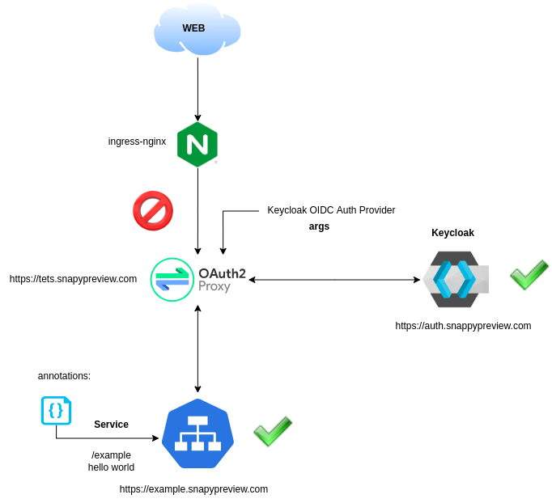

# Identity System

Requeriments:
1. Keycloak app
2. Example app
3. Oauth2-proxy

## HELM Install
Add helm chart
helm repo add codecentric https://codecentric.github.io/helm-charts  
Update helm chart  
helm repo update  
Download values.yml: https://github.com/codecentric/helm-charts/blob/master/charts/keycloak/values.yaml   
Install: helm install keycloak codecentric/keycloak --values values.yaml
## Keycloak configuration
ingress: https://auth.snappypreview.com
client-id=oauth2-proxy
## Oauth2-proxy configuration
ingress: https://test.snappypreview.com  
client-secret=o8NBJQ16Sh5zGSmk4LSEO9HouR0kYlrb  
redirect-url=https://test.snappypreview.com/oauth2/callback  
cookie-secret=gMGJGeNSVvaexhtRX_3V811lfm7Ekhr5F02DD7LYyxc=  
## Hello world configuration
ingress: https://example.snappypreview.com

## Source research
1. https://www.talkingquickly.co.uk/installing-keycloak-kubernetes-helm
2. https://www.talkingquickly.co.uk/webapp-authentication-keycloak-OAuth2-proxy-nginx-ingress-kubernetes
3. https://www.youtube.com/watch?v=0TiRsueDmO4
